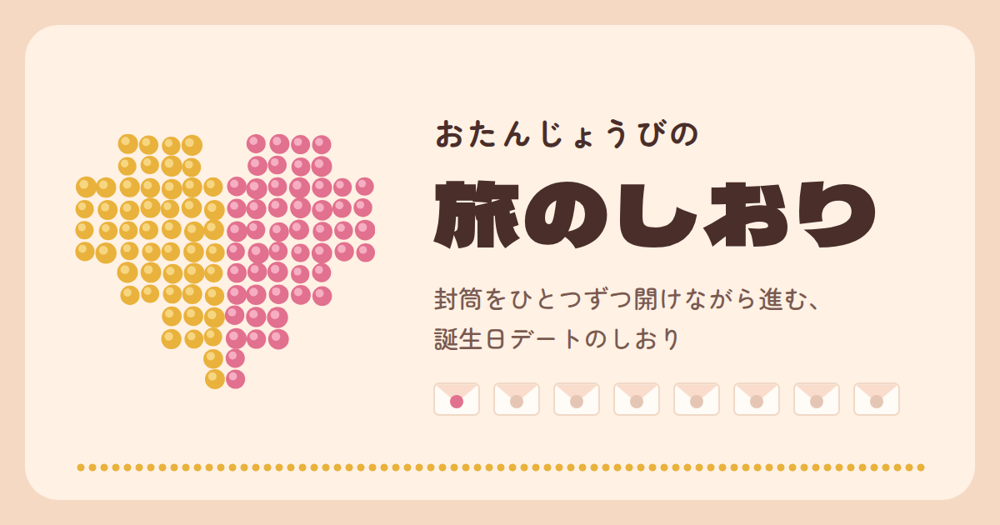

# おたんじょうび旅のしおり

封筒をひとつずつ開けながら進む、誕生日デート用の「旅のしおり」です。
HTMLファイル1枚で動くので、GitHub Pagesにそのまま置くだけで公開できます。



## 中身

| ファイル | 内容 |
| --- | --- |
| `index.html` | しおり本体（HTML・CSS・JavaScriptをすべて内包） |
| `ogp.png` | SNSでリンクを貼ったときに表示されるプレビュー画像（1200×630） |
| `.nojekyll` | GitHub Pagesにファイルを加工させず、そのまま公開するための空ファイル |
| `README.md` | このファイル |

## できること

- 8通の封筒を、時間に合わせて順番に開封していく仕組み（前の封筒を開けるまで次は開けられません）
- 開けた封筒と持ちもののチェックを、見ている端末に記録（ブラウザを閉じても続きから）
- 毛糸を打ちこんで「表にひっくり返す」体験ができる、タフティングのミニコーナー
- JavaScriptが動かない環境（ファイルのプレビューなど）でも、タップで封筒を開けられる
- スマホ向けの表示、ダークモード時はトーンを少し落とした配色

## 公開のしかた（git を使う場合）

GitHubで空のリポジトリ（Public）を作ってから、このフォルダで次を実行します。

```bash
git init
git add .
git commit -m "旅のしおりを追加"
git branch -M main
git remote add origin https://github.com/USERNAME/REPOSITORY.git
git push -u origin main
```

そのあと、GitHubのリポジトリで **Settings → Pages** を開き、
**Build and deployment** の **Source** を **Deploy from a branch**、
**Branch** を **main** と **/ (root)** にして **Save** します。
数分後に `https://USERNAME.github.io/REPOSITORY/` で公開されます（初回は10分ほどかかることがあります）。

git を使わない場合は、リポジトリ画面の **Add file → Upload files** から、このフォルダの中身をまとめてアップロードしても同じです。

## SNSプレビューの設定（1か所だけ書き換え）

`index.html` の `<head>` にある `og:url` と `og:image` の
`USERNAME` と `REPOSITORY` を、自分のものに置き換えてからpushしてください。

macOS・Linuxなら、次のコマンドでまとめて置き換えられます。

```bash
sed -i.bak -e 's/USERNAME/あなたのユーザー名/g' -e 's/REPOSITORY/リポジトリ名/g' index.html && rm index.html.bak
```

置き換えないままでもページは問題なく動きます。SNSでリンクを貼ったときに画像が出ないだけです。

## 中身を自分用に書き換えるとき

文章はすべて `index.html` の本文にそのまま書かれています。

- 各封筒は `<details class="env" id="env-1">` 〜 `id="env-8"` のブロックです。
- 封筒の外に見えるのは `<summary>` の中（番号・時刻・ヒント）、開けると出てくるのは `<div class="inside">` の中です。
- 封筒を増減する場合は、`data-n` の番号を1から順に振り直してください。

## 注意

- Publicリポジトリなので、GitHub上ではファイルの中身（封筒の中身を含む）を誰でも読めます。サプライズで使う場合、相手には github.io のURLだけを送ってください。
- 公開URLにはGitHubのユーザー名とリポジトリ名が入ります。
- 見出しの書体は Google Fonts（Dela Gothic One / Zen Maru Gothic、SIL Open Font License）を読み込んでいます。
